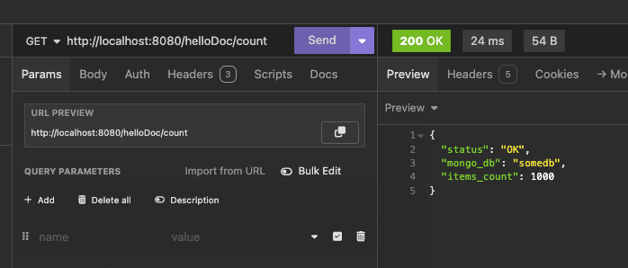
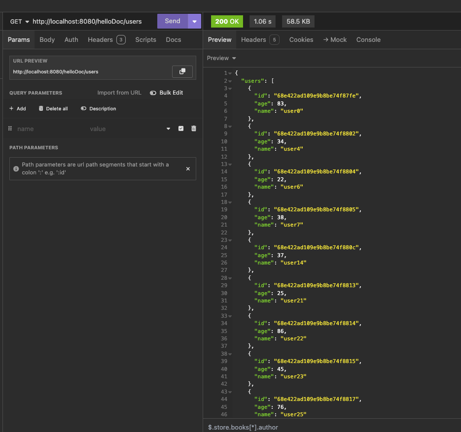

# mongo-sharding

#### Пошаговая инструкция по настройке шардирования в проекте _mongo-sharding_

1. Запустите проект:
    ```shell
    docker-compose up -d
    ```
    
    Должно подняться 5 контейнеров:
    ```shell
    NAME            IMAGE                                COMMAND                  SERVICE         CREATED          STATUS          PORTS
    config_server   dh-mirror.gitverse.ru/mongo:latest   "docker-entrypoint.s…"   config_server   33 seconds ago   Up 32 seconds   27017/tcp
    mongos          dh-mirror.gitverse.ru/mongo:latest   "docker-entrypoint.s…"   mongos          33 seconds ago   Up 32 seconds   0.0.0.0:27017->27017/tcp, [::]:27017->27017/tcp
    pymongo_api     mongo-sharding-pymongo_api           "uvicorn app:app --h…"   pymongo_api     33 seconds ago   Up 32 seconds   0.0.0.0:8080->8080/tcp, [::]:8080->8080/tcp
    shard1          dh-mirror.gitverse.ru/mongo:latest   "docker-entrypoint.s…"   shard1          33 seconds ago   Up 32 seconds   27017/tcp
    shard2          dh-mirror.gitverse.ru/mongo:latest   "docker-entrypoint.s…"   shard2          33 seconds ago   Up 32 seconds   27017/tcp
    ```

2. Инициализация репликасета конфигурационного сервера:
    ```shell
    docker compose exec -T config_server mongosh --port 27017 --quiet <<EOF
    rs.initiate({
      _id: 'configRS',
      configsvr: true,
      members: [
        { _id: 0, host: 'config_server:27017' }
      ]
    })
    EOF
    ```
   
    В случае успеха в выводе `rs.status()` должна быть информация о состоянии:
    ```shell
    configRS [direct: primary] test> {
       members: [
        {
          _id: 0,
          name: 'config_server:27017',
          health: 1,
          state: 1,
          stateStr: 'PRIMARY',
          ...
        }
       ],
       ok: 1
    }
    ```

3. Инициализация репликасета первого шарда:
    ```shell
    docker compose exec -T shard1 mongosh --port 27018 --quiet <<EOF
    rs.initiate({
      _id: 'shard1RS',
      members: [
        { _id: 0, host: 'shard1:27018' }
      ]
    })
    EOF
    ```

   В случае успеха в выводе `rs.status()` должна быть информация о состоянии:
    ```shell
    shard1RS [direct: primary] test> {
       members: [
        {
          _id: 0,
          name: 'shard1:27018',
          health: 1,
          state: 1,
          stateStr: 'PRIMARY',
          ...
        }
       ],
       ok: 1
    }
    ```

4. Инициализация репликасета второго шарда:
    ```shell
    docker compose exec -T shard2 mongosh --port 27019 --quiet <<EOF
    rs.initiate({
      _id: 'shard2RS',
      members: [
        { _id: 0, host: 'shard2:27019' }
      ]
    })
    EOF
    ```

   В случае успеха в выводе `rs.status()` должна быть информация о состоянии:
    ```shell
    shard2RS [direct: primary] test> {
       members: [
        {
          _id: 0,
          name: 'shard2:27019',
          health: 1,
          state: 1,
          stateStr: 'PRIMARY',
          ...
        }
       ],
       ok: 1
    }
    ```

5. Добавление шардов:
    ```shell
    docker compose exec -T mongos mongosh --port 27017 --quiet <<EOF
    sh.addShard('shard1RS/shard1:27018')
    sh.addShard('shard2RS/shard2:27019')
    EOF
    ```

   В случае успеха в выводе `rs.status()` должна быть информация о добавленных шардах:
    ```shell
    shards
    [
      {
        _id: 'shard1RS',
        host: 'shard1RS/shard1:27018',
        state: 1,
        topologyTime: Timestamp({ t: 1759780736, i: 10 }),
        replSetConfigVersion: Long('-1')
      },
      {
        _id: 'shard2RS',
        host: 'shard2RS/shard2:27019',
        state: 1,
        topologyTime: Timestamp({ t: 1759780736, i: 28 }),
        replSetConfigVersion: Long('-1')
      }
    ]
    ```

6. Активация шардирования для базы `somedb`:
    ```shell
    docker compose exec -T mongos mongosh --port 27017 --quiet <<EOF
    use somedb
    sh.enableSharding('somedb')
    EOF
    ```

   В случае успеха в выводе `sh.status()` должна быть информация о шардировании:
    ```shell
    database: { _id: 'config', primary: 'config', partitioned: true },
    ```

7. Создание коллеции `helloDoc`:
    ```shell
    docker compose exec -T mongos mongosh --port 27017 --quiet <<EOF
    use somedb
    sh.shardCollection('somedb.helloDoc', { '_id': 'hashed' })
    EOF
    ```

   В случае успеха в выводе `sh.status()` должна быть информация о коллекции:
    ```shell
    collections: {
      'somedb.helloDoc': {
        shardKey: { _id: 'hashed' },
        unique: false,
        balancing: true,
        chunkMetadata: [
          { shard: 'shard1RS', nChunks: 1 },
          { shard: 'shard2RS', nChunks: 1 }
        ],
        chunks: [
          { min: { _id: MinKey() }, max: { _id: Long('0') }, 'on shard': 'shard2RS', 'last modified': Timestamp({ t: 1, i: 0 }) },
          { min: { _id: Long('0') }, max: { _id: MaxKey() }, 'on shard': 'shard1RS', 'last modified': Timestamp({ t: 1, i: 1 }) }
        ],
        tags: []
      }
    }
    ```

Шардирование настроено.

Сгенерируем тестовые данные:
```shell
docker compose exec -T mongos mongosh --port 27017 --quiet <<EOF
use somedb
for(var i = 0; i < 1000; i++) {
  db.helloDoc.insertOne({
    age: Math.floor(Math.random() * 71) + 20,
    name: 'user' + i,
    email: 'user' + i + '@example.com',
    created_at: new Date()
  })
}
EOF
```

Проверить документы в шардах можно следующим образом:
```shell
docker compose exec -T shard1 mongosh --port 27018 --quiet <<EOF
use somedb
db.helloDoc.countDocuments()
EOF
shard1RS [direct: primary] test> switched to db somedb
shard1RS [direct: primary] somedb> 504
                                                                                                                                                                                                                                                                               
docker compose exec -T shard2 mongosh --port 27019 --quiet <<EOF
use somedb
db.helloDoc.countDocuments()
EOF
shard2RS [direct: primary] test> switched to db somedb
shard2RS [direct: primary] somedb> 496
```

Автоматизированный вариант - вызов скрипта init.sh. Скрипт init.sh содержит команды по настройке репликасетов,
шардирования и репликации. Также с помощью скрипта можно добавить тестовые данные.  
Доступные команды:
- -s [INT] - время ожидания синхронизации в секундах
- -i - флаг генерации тестовых данных

Пример использования:
   ```shell
   # Выполнить инициализацию кластера с задержкой в 60 секунд для ожидания синхронизации данных и добавить тестовые данные
   init.sh -s 60 -i
   ```

#### Вывод API
1. Количество документов  
     
 
2. Пользователи  
   